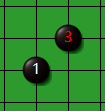
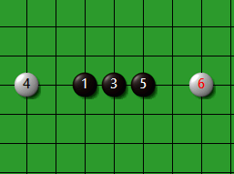
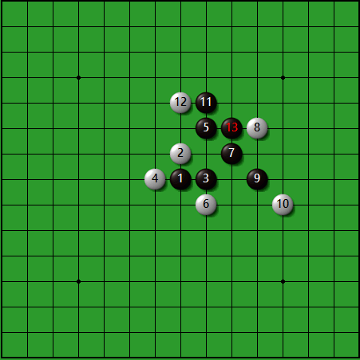
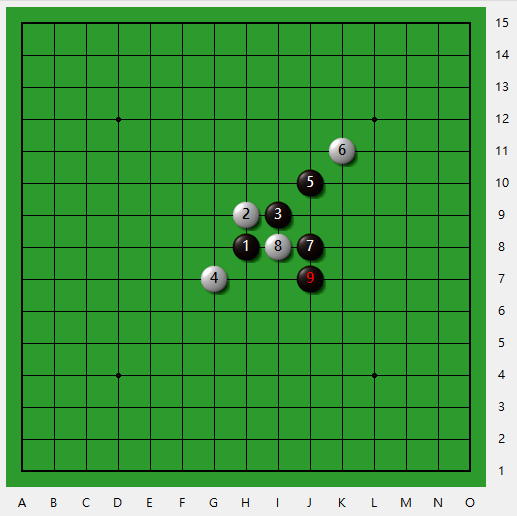
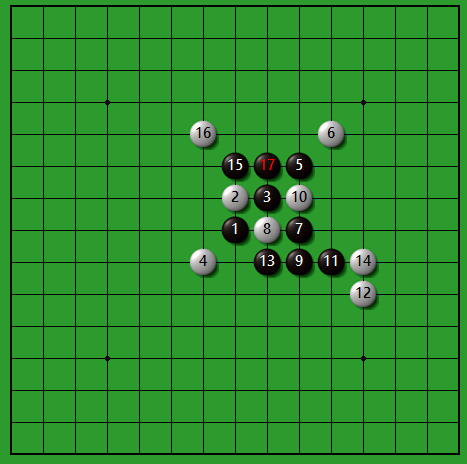
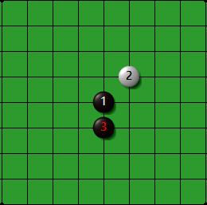
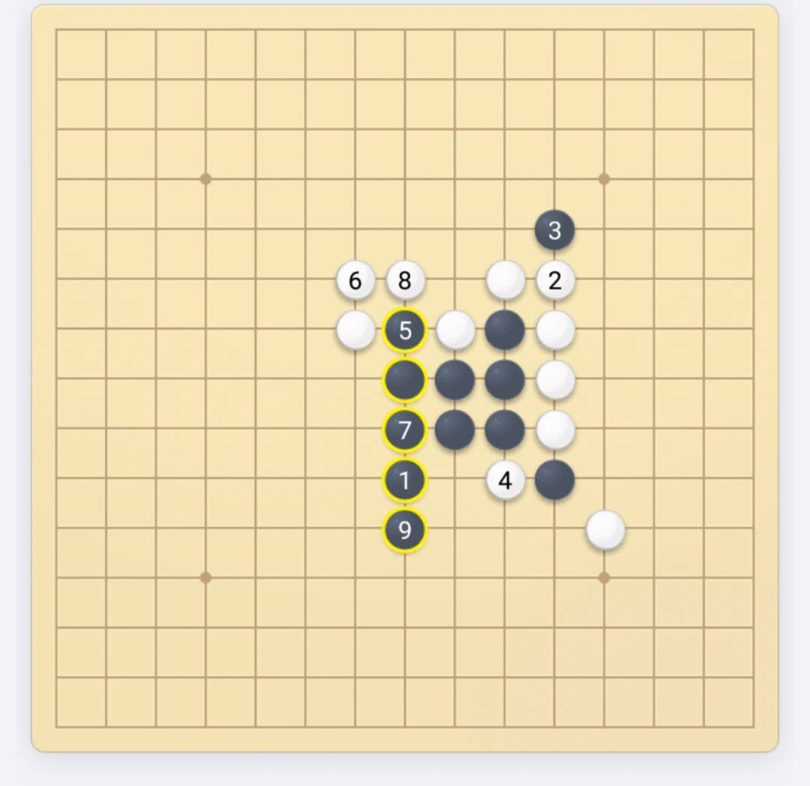
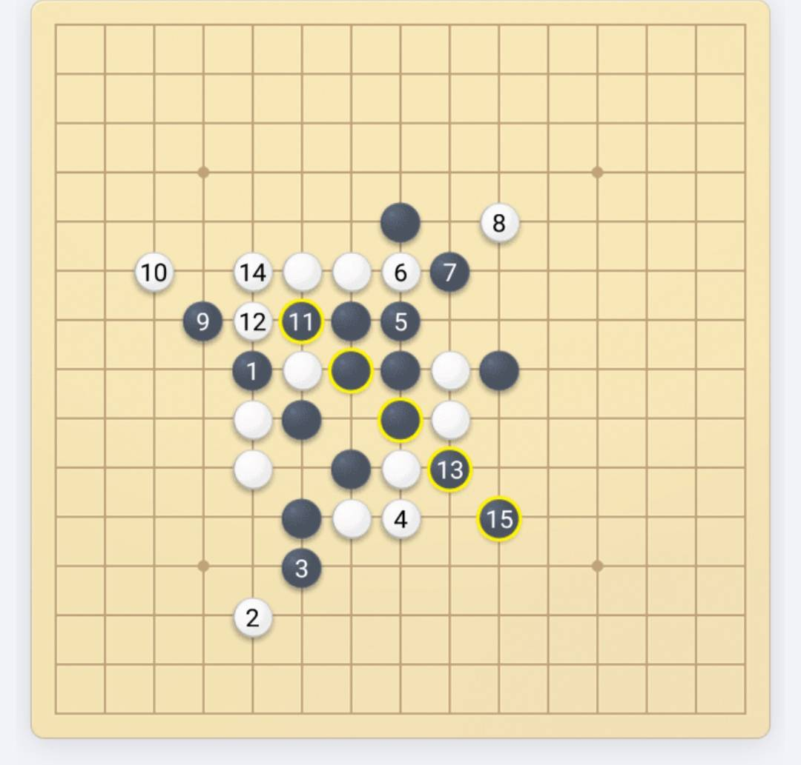

# 五子棋筆記

## 規則
+ ### 基礎規則
    #### 五子棋棋盤是15*15的正方形，棋子要下在交叉線上
    #### 黑棋先下，白棋後手，輪流下一手，相連五子得勝
+ ### 禁手規則(日規)
    #### 黑子不能下雙三、雙四、長連，這幾種陣型，若下到判輸，但若同時達成五子還是判贏


## 基本威脅度
+ ### 一顆子沒威脅度，二子以上有威脅度
+ ### 二(開始有威脅)
    + #### 活二
      ```
      再下一顆棋就能變成活三的二
      屬於材料，為以後走活三做得準備
      ```
    
    
    + #### 小跳二(佈局好用)
    
    
    + #### 大跳二(佈局好用)
    
    
   + #### 眠二
     ```
     再加一子只能走出眠三的二
     連材料都不算
     ```
     
     
     
     
     
+ ### 三(有威脅)
    + #### 活三
      ```
      再下一顆棋就能變成活四的三
      進攻形狀
      ```
        
        
    + #### 跳三(佈局好用)
        
            
    + #### 眠三
      ```
      再下一顆棋就能變成衝四的三
      屬於材料，為以後走衝四做得準備
      前三個眠三比較一般，只能用一次性，後三個眠三比較特殊，可以使用兩次
      尤其第四種的特殊型眠三，殺傷力最大，範圍也最廣
      ```
        
                      
                      
          
          
         
+ ### 四(超級有威脅)
    + #### 活四
      ```
      兩邊都能走出五連的四
      必勝形狀
      ```
        
        
    + #### 衝四
      ```
      只有一邊能走出五連的四
      進攻形狀
      ```
        
        
    + #### 跳衝四
        
          
          
+ #### 長連(黑禁手不能下)
  ```
  再下一顆子連起來超過五顆的狀況
  ```
  

## 圖形
  ### 進攻圖形
  
  
  ### 劍陣
  
  
  
  
  
  ```
  第二步的白子一定要是直指
  第三步的黑子一定要是斜的
  第六步白子下了活三，陣行已成
  第七步黑子阻擋+形成大跳二
  劍陣破解，關鍵在於第六步的白子只要下對位置，黑子必敗    
  ```
  ### 扁擔陣
  
  ```
  很明顯如果黑子下中間會形成雙四，所以對於黑子來說是禁手點
  ```
  ### 防守技巧 -八卦陣
  
  
  ```
  防禦型的陣法，基本上白子才會用
  走日字走法，有直的日字跟躺的日字，右下跟左上一致，左下跟右上一致
  也就是說如果右下方向走躺日的話，左上方向也是要走躺日，那左下跟右上都會是直日走法
  破解:搶佔對方的卦點或者用跳子衝出來
  ```
  ### 防守技巧 - 搶佔團角
  
  ```
  第6手白佔黑子的團角
  ```
  ### 防守技巧 - 觀察一子通三路
  
  
  
  ```
  1. 第8手白子的位置及黑子的一子通三路點，最直接解決方法就是搶佔
  2. 在有禁手的規則裡，第8手白子也可以下這位置，其實就是想到對方一子通三路後，是否有反活三或反制的手段，如果有，那也會是個好選擇
  3. 在無禁手的規則裡，第8手白子也可以下這位置，其實也是跟上面一樣，就是想對方如果下了一子通三路，後面防禦如何進行
  ```
  ### 防守技巧-跳擋活二
  ```
  適用場合
  1. 想阻止對方的活三方向
  2. 不怕對方往另一個方向活三
  3. 之後可以有連續進攻的手段或者製造進攻材料
  ```
  
  
  
  
  ```
  1. 斜月開局，第13手黑棋跳擋白的活二，且之後可以利用第15手黑的位置來做一子通三路，比直接擋還好不少
  2. 斜月開局，第11手黑同樣的道理
  3. 疏星開局，第11手黑如果直接擋白的活二，看似連結不錯，但如果第12手白，直接一擋，那黑子發展受限制比較大，且黑子如果執意活三，會被白子搶回先手權進而雙三的
  4. 因此，上面那局，黑第11首可利用跳擋活二，且下一步黑棋還能下第13手位置製造材料
  ```
  ### 防守技巧 - 牽制
  
  
  
  
  ```
  1. 花月開局，第7手黑是牽制作用，如果白子下活三那就能反三搶回先手權，如果黑不管白的活三，那很可能被白一波帶走，如下
  2. 上一局，若黑7沒管的話，白一路到22手白一子雙殺點直接帶走
  3. 第11手黑要是顧著自己佈局，也會被白子一波帶走的
  4. 第11手黑是妙手，若白子跟剛才一樣，想做連續進攻，那會在第15手被黑搶回先手權，並被一波帶走
  ```
  ### 進攻技巧 - 做殺
  ```
  做殺可以算是進攻技巧也可以拿來當防守技巧用，有時候適合的做殺可以破解對方的連續進攻
  基本上是透過眠三或者是活二的方式來做出殺棋
  . 有眠三就做活二
  . 有活二就做眠三
  . 做殺比直接進攻多了防止反活三、反衝四的選擇
  . 做殺能擴展進攻範圍，讓有限材料反覆被利用
  ```
  
  
  
  
  
  ```
  1. 有8個做殺點
  2. 有4個做殺點
  3. 黑子在F10(第17手)的地方做殺，白子H10直接擋住黑的43點，黑到第21手還是可以形成43殺，如果不做殺點，改直接衝H10進攻，這樣會被白子反三、反四的
  4. 黑子在I11(第19手)的地方做殺，白子F11擋住黑的43點，黑到第23手還是可以形成43殺
  5. 承上題，就算白子(第20手)堵在活二的位置，還是可以利用衝四後再43殺
  ```
  ### 進攻技巧 - 進攻組合
  ```
  一子落下，一邊進攻一邊做新材料
  . 活三做活二
  一子落下，形成活三的同時做新活二
  . 衝四做活二
  一子落下，形成衝四的同時做新活二
  . 活三做眠三
  一子落下，形成活三的同時做新眠三
  . 衝四做眠三
  一子落下，形成衝四的同時做新眠三
  ```
  
  
  
  
  ```
  1. 第12手白子落下即活三做活二，接著白可以做33點了
  2. 第15手黑子落下即衝四做活二，接著黑可以做43點了
  3. 第13手黑子落下即活三做眠三，接著黑可以做43點了
  4. 第13手黑子落下即衝四做眠三，接著黑可以做43點了
  ```
  ### 進攻技巧 - 兩步殺
  ```
  1. 數材料(眠三、活二)
  2. 找出進攻組合
  3. 逐個算殺
  ```
  
  
  ```
  1. 黑棋兩個材料
  2. 黑棋有三個點是進攻組合
  3. A、B點都能有殺，但B點的殺是33點，在禁手規則不行，所以A點的殺比較好
  ```
  ### 其餘進攻圖形
  
  
  
  
  
  
  
  ```
  1. 閃電陣，基本上白子比較好用，黑棋要避開禁手
  2. S陣，小心為上
  3. 梅花陣
  4. 工字陣
  5. X陣
  6. 三子強陣1
  7. 三子強陣2
  ``` 
  ### 殺型1
  
  
  
  
  
  ```
  1. 第12手白形成殺型
  2. 第24手白43勝
  3. 第24手白43勝
  4. 第26手白43勝，注意，第20手跟22手建議的活三是為了不讓黑子衝四阻擋
  5. 第22手白43前一手一子雙殺
  ```

  ### 殺型2
  
  
  
  
  
  ```
  1. 第12手白是妙手，形成殺型
  2. 第18手白是43勝
  3. 第18手白是43前一手跟雙3前一手，一子雙殺
  4. 第26手白是43勝
  5. 第26手白是43勝
  其實我用AI模擬好像第14手白子衝四先衝了在下第12手的白子也可以，也就是第12手跟第14手順序互換也一樣的結局，白子很容易做雙活三，所以被阻擋就直接43了
  ```

  ### 殺型3
  
  
  
  
  
  ```
  1. 第11手黑殺型已成
  2. 第25手黑43勝
  3. 第25手黑43勝
  4. 第27手黑43勝
  5. 第23手黑妙手，有兩個目的，一個是配合雙衝四形成43，另一個是與下面的跳衝四可以連接
  6. 第35手黑43勝
  ```

  ### 殺型4
  
  
  
  
  
  
  
  ```
  1. 第11手黑完成殺型
  2. 第13手黑一子雙殺(雙43前一手)
  3. 第13手黑一子雙殺(雙43前一手)
  4. 第13手黑關鍵(43前一手,VCF)
  5. 第13手黑一子雙殺(雙43前一手)
  6. 第25手為黑43勝
  7. 第21手為黑43勝
  ```

  ### 殺型5
  
  
  
  ```
  1. 已成VCT圖形
  2. 第17手黑43勝
  3. 第13手黑一子雙殺點
  ```

  ### 殺型6
  
  
  
  
  
  
  ```
  其實這局是我從之前下的局裡面擷取出來獲勝的關鍵部分,AI幫我用三顆白子,僅有一個材料的情況下直接連續贏棋了
  1. 就這三顆,材料是一個活二,然後一個白子在日字方向,第4手白橫向往第2手白的方向不能有黑子
  2. 再來開始連續進攻了，第16手就是一子雙殺點,一個是中間的雙三點,另一個是直斜線的43點
  其實關鍵的就是,第13手黑擋上太弱了,擋下會磨比較久
  3. 若13手、15手黑都擋下的話，後續可以這樣操作，搞個X型
  4. 若13手堵下,15手堵上,那就轉為工字型,照殺
  5. 若第9手黑堵下面後續結果如圖，16手白一子雙殺
  6. 若第9手、13手黑都擋下的情況，最後三三抬走
  ```

 ### 殺型7
 
 
 
 
 
 
 ```
 這局也是AI幫我下的,挑戰者是微信的機器人,我給AI壓力測試,執白+無禁手+一開始跳一格防守讓子,結果微信機器人還是被秒殺了,進攻精髓跟第6型一樣,一個活二加馬步一子
 1. 就這三顆,材料是一個活二,然後白子依舊日字方向有一顆
 2. 一開始微信機器人是這樣輸的
 3. 若17手黑改堵下面,馬上工字雙三抬走
 4. 若15手黑改堵下面,也是一樣結果,工字雙三抬走
 5. 若11手黑改堵右邊,一樣不久雙三抬走
 6. 若15手黑改擋上面,一樣不久四三抬走
 ```

## 26種開局
### 斜指開局
  
### 直指開局
  
```
兩黑子中間間隔一格為星，其餘為月
```
### 1. 寒星(直指)

```
五手兩打必勝
```
### 2. 溪月(直指)

```
五手兩打必勝
```
### 3. 疏星(直指)

```
平衡開局
```
### 4. 花月(直指)

```
五手兩打必勝
是直指開局中優勢最大的開局
```
```
1. 白6下K11的位置及後續
2. 第九手黑已經贏了
3. 第十七手黑，一子雙殺點，第十二手白是弱防禦
4. 第十六手白，檔左邊43點也是錯的，這樣右邊黑直接兩手43殺
5 第十九手黑，檔住白的43殺，且自己做活三
6. 第十五手黑，做了兩個雙殺點
7. 第十七手黑，不管白檔哪，另一邊都能做43殺
8. 第十五手黑，白檔中間，第十九手43勝
9. 第十五手黑，白檔下面，第二三手43勝
10. 第二十手白先利用衝四化解黑的43殺，但黑還是能用VCF
11. 跟上一解法差不多，有VCF
```







```
1. 白6下G10的位置及後續，很強的防守，還騙招
2. 第7手黑下在I8就是被騙了，會被抓禁手，之後白棋也比較容易有殺
3. 第8手白如果活三的話，第19手黑是一子雙殺點
4. 第8手白先活三的話要反三，一般人第12手會堵中間
5. 第12手白堵下面反三，先兩步衝四後，再反三阻擋，然後準備做43殺，如果白先在H12衝四阻擋再來防活三，但黑可以直接I12做43殺
6. 第12手白堵下面就算第18手衝四擋43殺再堵活三，結局還是沒兩下就被43殺了
7. 第12手白如果堵上面想做43殺的話，先手處理掉，再43抬走
8. 第10手堵下面的話，要注意被抓禁手
9. 第10手堵下面的處理，直接VCF
其實第8手白反三的後續，第10手白堵上中都沒差，主要注意不要讓白在上面做出反43，當你發現白都是擋上面的時候就要小心點了
10. 第8手白是強下法之一，第10手白檔右邊是不行的
11. 第10手白擋左邊反三，後續處理
12. 同上題，白衝四擋43也沒用，依然有43
13. 同上題，最強防是先衝四，還能抓禁手，而且白棋有一路抓禁手的空間，所以黑子要下對
14. 同上題，另一個防守，但還是被一子雙殺了
15. 第8手白另一種活三及VCF，這邊要注意一點的就是，別下另一個跳三跳四的43點，那會造成白子堵了衝四後原本的點變成了44禁手點的
16. 第8手白擋中間及後續
17. 第8手白擋斜活三及後續
18. 同上題，另一個方向擋加上衝四擋
```


### 5. 殘月(直指)

```
五手一打必勝，兩打黑大優
```
### 6. 雨月(直指)

```
五手兩打必勝
雨月開局跟雲月開局極為類似,所以只講用雨月來代表就好
```
```

```
### 7. 金星(直指)

```
五手兩打必勝
```
### 8. 松月(直指)

```
五手一打必勝，兩打黑優
```
### 9. 丘月(直指)

```
五手一打大優，兩打黑優
```
### 10. 新月(直指)

```
五手兩打必勝
```
### 11. 瑞星(直指)

```
平衡開局，五手一打必勝，兩打平衡
```
### 12. 山月(直指)

```
五手兩打必勝
```
### 13. 遊星(直指)


```
必敗開局，如果第四手白下對位置，黑必敗
```
### 14. 長星(斜指)

```
五手兩打白小優
```
### 15. 峽月(斜指)

```
五手兩打必勝
```
### 16. 恆星(斜指)

```
五手兩打必勝
```
### 17. 水月(斜指)

```
五手兩打必勝
```
### 18. 流星(斜指)

```
五手兩打白稍優
```
### 19. 雲月(斜指)

```
五手兩打必勝
```
### 20. 浦月(斜指)

```
五手兩打必勝
```
```
1. 第5手黑，最簡單的必勝點
2. 白6，H7，強防的狀況
3. 白8活三，黑13的活三還有擋住白43殺的作用
4. 白10堵上面及後續
5. 白8跳三防及後續
```


```
白6，H9，活三的狀況
1. 白10防左太弱
2. 白10防右的狀況
3. 白10防右狀況2
4. 白10防右狀況3，一子雙殺
```


### 21. 嵐月(斜指)

```
五手兩打必勝
```
### 22. 銀月(斜指)

```
五手兩打必勝
```
### 23. 明星(斜指)

```
五手兩打必勝
```
### 24. 斜月(斜指)

```
五手兩打，黑優局
```
### 25. 名月(斜指)

```
五手兩打必勝
```
### 26. 彗星(斜指)


```
五手兩打規則屬黑棋必敗開局，如果第四手白下對位置，黑必敗
```

## 開局記憶


+ ### 戰術
  + #### 盡量壓縮空間，把對方把空間少的地方擠  
  + #### 擋住對方活二，自己成為活二        
  + #### 留三不衝，待一擊斃命
  + #### 不知下哪時，找活三衝四，然後看方向，把方向串再一起
  + #### 材料可以想像延伸五顆子，若中間沒對方子時表示可以用，兩區域材料延伸線的交叉點，即為落子點
  + #### 若可以連續進攻就可以開始活三了，不然要先湊出多個活二材料，一般來說前幾子比較容易連續進攻，至少要有四顆子才能連續進攻到底，但要注意對方防守是否會有反三搶回主動權
  + #### VCT(Victory of Continuous Threats)通過連續的活三、衝四，直到獲勝
  + #### VCF(Victory of Continuous Four)連續衝四勝，指連續下出衝四，直到獲勝，VCF的手順，唯一要考慮的就是對手是否有反四
  + #### 先把路線看出來，路線有了就可以做一子雙殺點了，當你有兩組衝四可以跟現有的子形成2的時候，看看有沒有形成活三的交叉點，該交叉點即為一子雙殺點，注意，一子雙殺點的活三不能是同一個活三

+ ### 棋局賞析
  + #### 他人棋譜
      
    ```
    最主要第12步跟第14步都是四三前一手
    ```
  + #### 他人棋譜
      
      
      
      
      
      
      
      
      
    ```
    1. 浦月開局
    2. 第四手白是最強防守點，第五手黑是黑棋必勝點
    3. 第五手黑是黑優點
    4. 第六手白是常見初學者下的點，第七手黑是該情況最強的點，第八手白是該情況最好防守點，第九手黑落子基本上是贏了
    5. 第十七手黑43勝
    6. 第十七手黑43勝
    7. 第十七手黑43勝
    8. 第二一手黑43勝
    9. 第六手白為破解點
    ```
  + #### 他人棋譜
      
      
      
      
      
      
    ```
    1. 第五手就是必輸點，第六手白就必贏了，第十二手白是43前一手，第十六手白33勝
    2. 第十八手白43勝
    3. 第十四手白很重要，不然亂下很容易被黑棋43的
    4. 第十六手白主要是擋對面43，最重要的關鍵還是要小心對面阻擋形成的43
    5. 第十八手白43勝
    6. 第十六手白，雙殺點，有43與33雙殺
    ```
  + #### 他人棋譜
    
    
    
    
    
    
    ```
    1. 雨月開局，第八手白新手下法，必輸
    2. 第23手黑43勝
    3. 第19手黑43勝
    4. 第21手黑43勝
    5. 第27手黑43勝
    6. 第33手黑43勝
    ```
  + #### 他人棋譜
    
    
    
    ```
    黑子一開始佈八卦陣，白子搶佔卦點，第九手黑讓出了先手權，我用AI算，白直接連續進攻贏

    ```
  + #### 他人棋譜(防禦必勝)
    
    
    
    
    ```
    1. 丘月開局，第六手白防守是關鍵，第九手黑下那就必輸了
    2. 第九手黑擋這樣才對，第十手白最佳擋這樣
    3. 雨月開局，第八手白是關鍵，如果黑依然下雙活二，白就下活三
    4. 浦月開局，第六手白是關鍵
    ```
  + #### 他人棋譜   
    
    ```
    1. 花月開局，第46手白子叫殺了，黑方顯然沒看到
    ```
  + #### 他人棋譜  
    
    
    ```
    銀月開局，其實第8手白子落下很快就會輸了
    到第7手是做個小閃電，接著轉做工字
    第10手白擋左，黑斜活三往下發展，反之就往上
    ```
  + #### 殘局解題
      
      
      
      
      
      
      
    
    
    
    
    
    
    
    
    
    ```
    1. 最主要是先把四衝掉，以防白子衝四阻擋
    2. 第3、5、7手是關鍵
    3. 第3手定勝負，我還真沒看到
    4. 第1手一子雙殺點
    5. 第1手跟第3手是關鍵，第3手43前一手，要是白子先堵住了43，那可利用斜衝4後，再43勝
    6. 第1手就很重要，進攻兼防守
    7. 第1手一子雙殺點
    8. 第1手就一子雙殺了
    9. 兩個跳活三接43殺
    10. 這棋白子擋上太容易殺了，如果白子擋下要注意手順
    11. 上題加碼，如果白子擋下的話，要注意，先做上面43前一手逼迫白子阻擋後，再利用活三做出43殺，不然如果先做下面的43殺，會發現被白子反四
    12. 第6手白，很明顯是為了防止黑43殺所做的處理，如果黑真的43殺的話，白可反四，所以黑馬上轉了另一種方向的43殺
    13 第9手黑，其實就是一子雙殺的局面了，這局子用不多，卻簡單殺了
    14. 簡單的VCT
    15. 這題真的是蠻難的，尤其還要小心被抓禁手，利用斜衝四為新建立的衝四做基礎，然後搭配原有的活二湊成43勝
    16. 這局就是要小心被抓禁手跟之後的佈局
    ```
  + #### 自己對弈  
      
      
    
      
    ```
    跟微信的電腦對弈，恆星開局，無禁手真的難搞
    1. 第11手黑佈局的時候，不要理它，直接上面VCT
    2. 第16手白可以創造43殺，所以黑子必須防守，然後通過互相活三換子破壞黑子的陣型
    3. 防守不好很容易輸
    4. 前面跟電腦亂玩，後面交給AI，結果AI簡單少子佈局就輕鬆殺了，適用白子，主要靠著三顆子(10,16,24)進行連續進攻贏的,三顆子只有一個材料的情況下,直接贏得比賽,不過也要對方配合就是,不然就會需要用到更多的白子才能贏
    ```